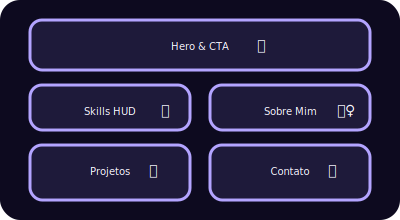

# 💗 IA Jovem – Landing Page

Uma landing page gamificada e ultra-rosa para apresentar a jornada digital de **Emily Rodrigues**.
Inspirada em HUDs de RPG, combina estética retrô com interações sonoras e botões que levam direto às redes profissionais de Emily.

## 🌟 Destaques da versão
- 🎨 **Tema principal rosa neon** com gradientes roxos e brilhos pulsantes.
- 🔗 **CTAs diretas** para o LinkedIn e GitHub de Emily em múltiplas seções.
- 🧠 **Manual de Estratégia atualizado** com foco em Python, SQL, Excel, Scrum e Machine Learning.
- 📂 **Inventário profissional revisado** para destacar formação e projetos mais relevantes.
- 🔊 **Experiência sonora opcional** com jingle de abertura e efeitos de clique.

## 🚀 Como visualizar
1. Clone ou baixe este repositório.
2. Abra `index.html` no navegador de sua preferência.
3. Ative o som (botão 🔊/🔇 no canto superior direito) para ouvir o jingle retrô.

## 🗂️ Estrutura dos arquivos
| Arquivo | Função |
| --- | --- |
| `index.html` | Estrutura da página e conteúdo temático. |
| `style.css` | Estilos neon, animações e responsividade. |
| `game.js` | Interações simples de áudio e HUD. |
| `docs/layout.svg` | Esquema visual da distribuição das seções. |

## 🧾 Créditos
Projeto fictício criado para destacar habilidades em dados, IA e design de experiências gamificadas.
Sinta-se à vontade para adaptar e continuar a quest! 💖
